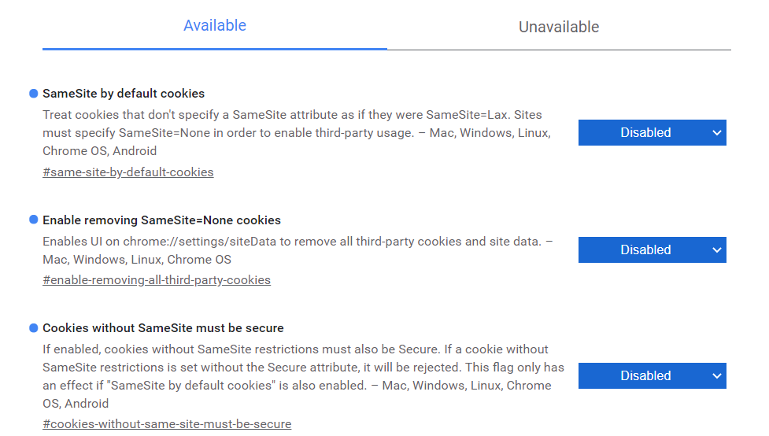
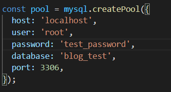

# 项目：个人博客

## 项目说明

* easy_blog：博客前端，使用 Vue3 框架，详情见路由文档
* blog-backend：博客后端，使用 NestJs 框架，详情见接口文档
* img：本说明的图片文件夹，与项目无关
* 博客功能展示.mp4：个人博客项目的功能展示视频

## 部署说明

### 跨域问题

&emsp;&emsp;我只简单解决了 Chrome 浏览器的跨域，这里除了在代码中设置 credentials 以外，还需要用 chrome 浏览器访问 chrome://flags，将如下三个条目设置为 disabled：



### 前端

* 进入 easy_blog 文件夹，并执行语句 **npm install**，下载依赖的第三方库
* 执行 **npm run serve** 运行前端

## 后端

* 进入 blog-backend 文件夹，并执行语句 **npm install**，下载依赖的第三方库
* 执行 **npm run start:dev** 运行后端

**注意:** 后端中数据库的配置在 blog-backend\src\database\database.service.ts 中，请根据实际情况修改：



## 数据库

&emsp;&emsp;本次项目需要手动执行建表语句建立数据库。最终效果大致如下：


### user

```mysql
CREATE TABLE IF NOT EXISTS user(
   `username` varchar(20) not null,
   `password` VARCHAR(50) not null,
   `nickname` varchar(20) not null default '',
   `realname` varchar(20) not null default '',
   `email` VARCHAR(20) not null default '',
   `phone` VARCHAR(15) not null default '',
   PRIMARY KEY ( `username` )
)ENGINE=InnoDB;
```

### token

```mysql
create table if not exists token(
	`username` varchar(20) not null,
    `token` varchar(512) not null,
    primary key (`username`),
    foreign key (`username`) references `user` (`username`)
)ENGINE=InnoDB;
```

### blogs

```mysql
create table if not exists blogs(
	`blogId` bigint not null,
    `author` varchar(20) not null,
    `title` varchar(50) not null,
    `text` text not null,
    `category` varchar(10) not null default '',
	`tags` varchar(30) not null default '',
    `firstPublic` TIMESTAMP DEFAULT CURRENT_TIMESTAMP,
    `lastPublic` TIMESTAMP DEFAULT CURRENT_TIMESTAMP ON UPDATE CURRENT_TIMESTAMP,
    `viewed` int not null default 0,
    primary key (`blogId`),
    foreign key (`author`) references `user` (`username`)
)ENGINE=InnoDB;
```

### files

```mysql
create table if not exists files(
	`fId` bigint not null auto_increment,
    `username` varchar(20) not null,
    `mimetype` varchar(10) not null,
    primary key(`fId`),
    foreign key (`username`) references `user` (`username`)
)ENGINE=InnoDB;
```

